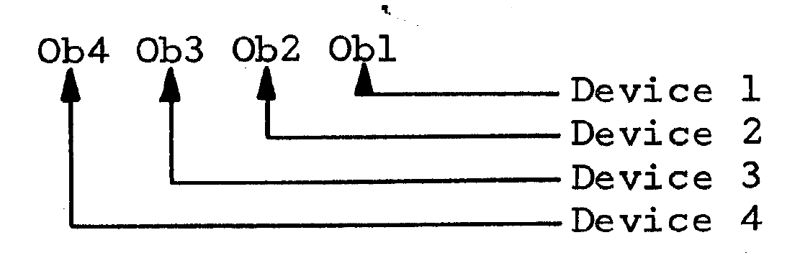

Litton Device Identifiers
=========================

## Technical Reference Manual

Section 3.6 of the [Litton 1600 Technical Reference Manual](http://www.bitsavers.org/pdf/litton/Litton1600_TechnicalRefMan.pdf)
specifies that an 8-bit value is used to select a device or devices
using a bitmask.

The section indicates that the top 4 bits indicate which device groups
should be selected, and the low 4 bits indicate which devices within
the groups should be selected:

 

Section 3.6 indicates that up to 8 input devices and 8 output devices
can be supported with this 4-bit group and 4-bit device mechanism.

However, there is a hand-written note on page 36 that indicates that Ob5 is
used as a device bit:

The group for "normal" devices is Ob7, with the following bits within the
group:

* Ob1 for the printer
* Ob2 for the tape punch
* Ob3 unused
* Ob4 for the keyboard
* Ob5 for the tape reader

## System Programming Manual

Page 40 of the Litton EBS1231 System Programming Manual indicates that
devices are identified by a 6-bit octal code with 3 bits for input devices
and 3 bits for output devices:

These bits line up with Ob1 to Ob6.

Best guess as to the actual device numbering is that when Ob7 is set, the
low 6 bits indicate the standard input and output devices.
The resulting hexadecimal codes for the standard devices are:

* $41 for the printer (channel 1)
* $42 for the tape punch (channel 2)
* $44 for the spare output device (channel 3)
* $48 for the keyboard (channel 1)
* $50 for the tape reader (channel 2)
* $60 for the spare input device (channel 3)

The tools in this repository assume that Ob7 and Ob8 are group bits
with Ob1 to Ob6 as device bits.  This allows up to 12 devices;
6 input devices and 6 output devices.

## OPUS

OPUS is known to use the following device identifiers:

* $41 for selecting the printer
* $48 for selecting the keyboard
* $49 for selecting both the printer and the keyboard at the same time
* $C0 to reset all devices
