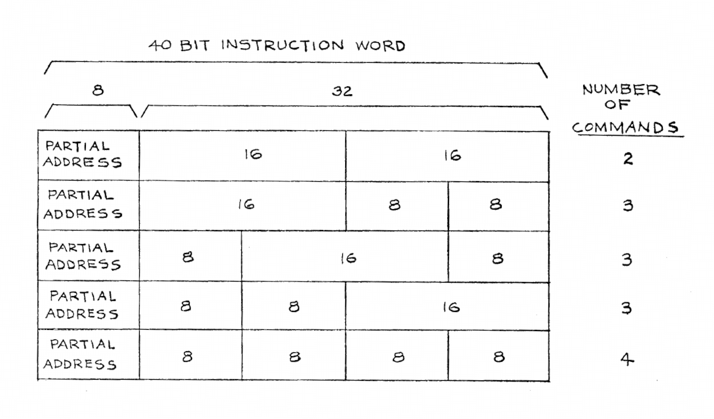

Explainer for Litton Instruction Precession
===========================================

Section 3.1.3 of the [Litton 1600 Technical Reference Manual](http://www.bitsavers.org/pdf/litton/Litton1600_TechnicalRefMan.pdf)
explains how instructions are fetched and executed, but it can be a
little confusing to the beginning Litton programmer.

## Instruction word format

Every instruction word in memory is 40 bits in size.  The high 8 bits are
the partial address of the next instruction to execute in the same page.
The remaining 32 bits may contain four 8-bit instructions, two 16-bit
instructions, or a single 16-bit instruction together with two 8-bit
instructions.  The following diagram is from the manual:

## Example

As an example, consider the following contents of memory (address: instruction):

    300: 01 09 0B B3 45
    301: 02 00 E3 00 0A

The instruction at address 300 is:

* `01` - Partial address of the next instruction is 01, that is `301` is
the next instruction word in sequence.
* `09` - "CL" instruction which clears the accumulator.
* `0B` - "CM" instruction which negates (complements) the value in the accumulator.
* `B3 45` - "ST 345" instruction which stores the accumulator into address 345.

The instruction at address 301 is:

* `02` - Partial address of the next instruction is 02, that is `302` is
the next instruction word in sequence.
* `00` - Halt the machine.
* `E3 00` - "JU 300" instruction which jumps to address 300.
* `0A` - NOP instruction to pad the word; never reached.

## Running the example

The machine has two registers that assist in instruction execution:

* CR - 8-bit command register.
* I - 40-bit instruction register.

Together these make up a 48-bit rotating shift register.  We will use
I0 to mean bits 0-7 of I, I8 to mean bits 8-15, and so on.

Let us assume that CR and I are initially set to "E3 00 -- -- -- --"
where the dashes are don't care bytes.  Execution proceeds as follows:

<table border="1">
<tr><td><b>Step</b></td><td><b>CR</b></td><td><b>I32</b></td><td><b>I24</b></td><td><b>I16</b></td><td><b>I8</b></td><td><b>I0</b></td></tr>
<tr><td>Start</td><td>E3</td><td>00</td><td>--</td><td>--</td><td>--</td><td>--</td></tr>
<tr><td>Load contents of 300 into I to perform a jump</td><td>E3</td><td>01</td><td>09</td><td>0B</td><td>B3</td><td>45</td></tr>
<tr><td>Rotate CR/I by two places (E301 is a 16-bit instruction)</td><td>09</td><td>0B</td><td>B3</td><td>45</td><td>E3</td><td>01</td></tr>
<tr><td>Execute 09 and rotate CR/I by one place (8-bit instruction)</td><td>0B</td><td>B3</td><td>45</td><td>E3</td><td>01</td><td>09</td></tr>
<tr><td>Execute 0B and rotate CR/I by one place (8-bit instruction)</td><td>B3</td><td>45</td><td>E3</td><td>01</td><td>09</td><td>0B</td></tr>
<tr><td>Execute B345 and rotate CR/I by two places (16-bit instruction)</td><td>E3</td><td>01</td><td>09</td><td>0B</td><td>B3</td><td>45</td></tr>
<tr><td>Load contents of 301 into I to perform a jump</td><td>E3</td><td>02</td><td>00</td><td>E3</td><td>00</td><td>0A</td></tr>
<tr><td>Rotate CR/I by two places (E302 is a 16-bit instruction)</td><td>00</td><td>E3</td><td>00</td><td>0A</td><td>E3</td><td>02</td></tr>
<tr><td>Halt the machine due to 8-bit instruction 00 (and rotate)</td><td>E3</td><td>00</td><td>0A</td><td>E3</td><td>02</td><td>00</td></tr>
</table>

If we were to resume the machine in this state, it would execute "E300",
jump back to 300, and repeat the sequence above.  The implicit jump to 302 due
to the partial address 02 is never reached.

The instructions "precess" through CR and I as they are executed.  Jump
instructions cause the destination word to be loaded into I and
execution proceeds from there on.
